# Credit programme Scripting languages - Trip planning application

The travel planning application was developed as a credit project from the course 'Scripting Languages'. The project confronts the real problems of the lengthy trip 
planning process by making it easier by storing all the important information in one place.

### The app stores information such as:
* destination and length of the trip,
* means of transport used to get to and back from the trip,
* detailed plan for each day,
* forecasted or archived weather.

### The application also allows to:
* keep transport/attraction tickets,
* export the plan to a ".ics" file for import into the calendar (once the planning is complete),
* save unfinished plans for later editing.

 

## Instalation

1. Clone the repository to your device (git clone [https://github.com/MarcinFed/Projekt_Jezyki_Skryptowe](https://github.com/MarcinFed/Projekt_Jezyki_Skryptowe))

2. Go to the project catalogue

3. Install dependencies:
    - pip install PyQt6
    - pip install vobject
    - pip install pickle
    - pip install requests
    - pip install mtranslate

 

## Application launching

1. Navigate to the project directory if you have not already done so

2. Launch the application: python -m Frontend.MainGUI

 

## How to use

### Main app window

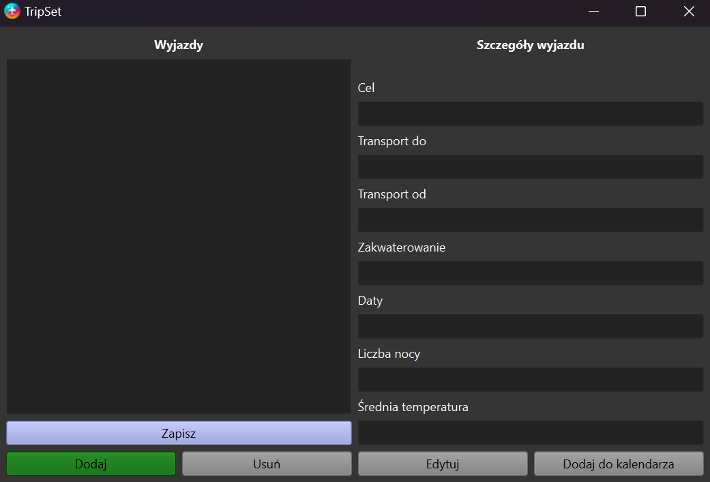

In this window, you can see a list of all the trips you have planned; if you click on one, its details will appear on the right-hand side.
The main application window also contains buttons for:
* adding new trips,
* deleting a selected trip,
* editing a selected trip, 
* adding a trip to the calendar.

### Calendar error window

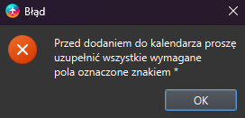

After clicking on "Dodaj do kalendarza", a message will be displayed if all the required fields have not been filled in.

### Calendar saved window

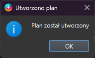

After clicking on "Dodaj do kalendarza", a message will be displayed if all data have been entered correctly.

### Add travel window 

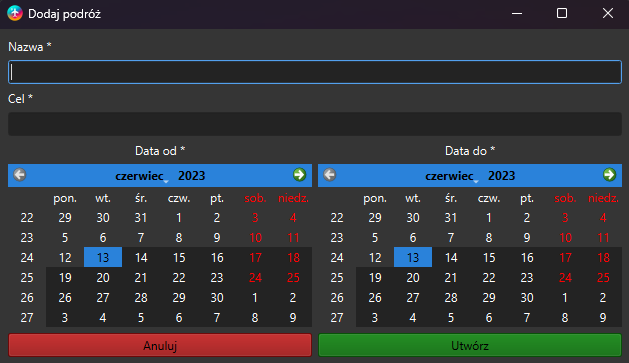

In this window, basic information about the trip is added:
* name of the trip, 
* destination of the trip, 
* dates from and until when the trip will be.

### Wrong name of destination

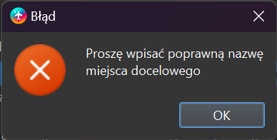

If you enter an invalid destination name when adding a trip, the following message will appear.

### Incomplete data window

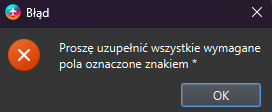

If an attempt is made to save incomplete trip data (mandatory data marked with "*") at any stage, a window will appear.

### Travel edit choice window

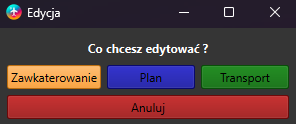

When you select to edit a selected journey, a window appears in the main window which allows you to select which aspect of the journey you wish to edit. You can choose: 
* accommodation,
* transport,
* trip schedule.

### Add transport window

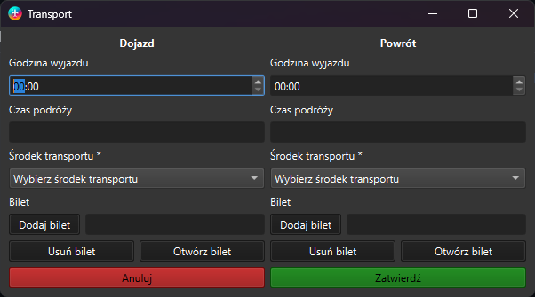

After selecting the edition of the transport, a window is displayed allowing the addition/editing of information on the:
* time of departure, 
* length of the journey, 
* means of transport (and in the case of selecting the transport which requires a ticket, the application enables the attachment of the ticket).

### Add accommodation edit window

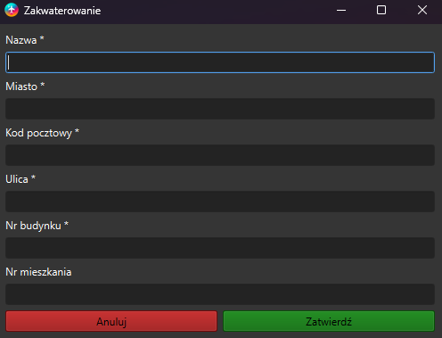

After choosing to edit the accommodation, a window opens where we can edit/add information on: 
* name of accommodation, 
* city in which the accommodation is located, 
* street, 
* postal code, 
* house number, 
* flat number.

### Edit plan window

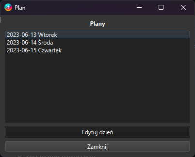

After choosing to edit the tour itinerary, a window is displayed in which all the days of the trip are displayed; after selecting a specific day, we have the option to edit the plan for that day.

### Edit selected day

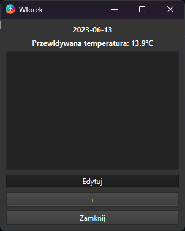

After choosing to edit the plan for a specific day, a window of currently set activities for that day is displayed. By clicking on the "+" button, you can add a new activity. The "Edytuj" button allows you to edit the selected activity.
This window also contains information on the average predicted/archived temperature of the day.

### Edit choice on activity window

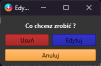

When you select to edit a specific activity, a window for selecting an action on it is displayed. You can choose between deleting an activity and editing it.

### Add activity window

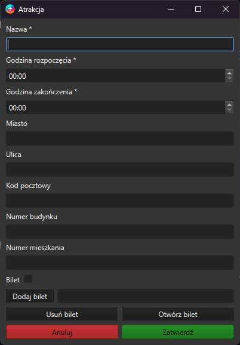

When you select to edit a specific activity, a window appears in which you can edit/add information about the activity, such as: 
* the name of the activity, 
* the times from and to when it will take place, 
* the city, 
* street, 
* postcode, 
* building number, 
* flat number, 
* whether a ticket is needed (if it is needed you have the option to attach it)

### Confirm delete window

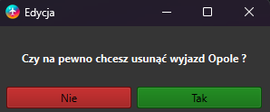

If you attempt to remove a trip from the list using the "usuń" button on the main window, a window will appear to confirm the decision.

### Successfully saved window

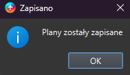

If the "zapisz" option is selected in the main window, a confirmation window will be displayed after the data has been correctly saved.

 

## Author

### Marcin Fedorowicz

